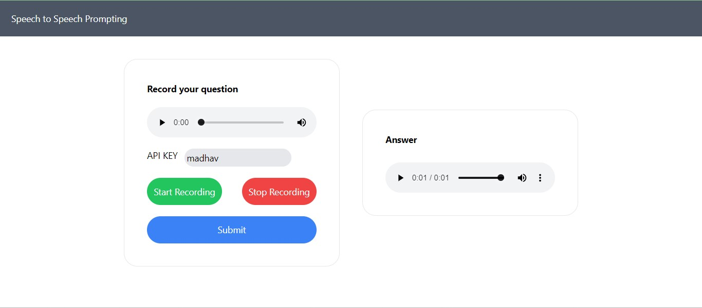

# Backend Voice Conversation SDK for LLM Apps

Develop a streamlined library enabling the creation of voice bots powered by Large Language Models (LLMs) with minimal latency. The primary goal is to empower developers to transform LLM-based chatbots into voice bots, facilitating interactions through voice commands and responses.

## Authors

- [@MadGanGithub](https://github.com/MadGanGithub)

## Deployment

Frontend of the application has been deployed successfully on Vercel\
https://punt-frontend-puce.vercel.app/

#Backend:

Backend of the application has been deployed using Docker image
https://punt-backend.vercel.app/

#Video:
Complete walkthrough of the web app is given in this video

## Screenshots

## Contact

For more information, contact [me](mailto:madhavganesan95@gmail.com).
